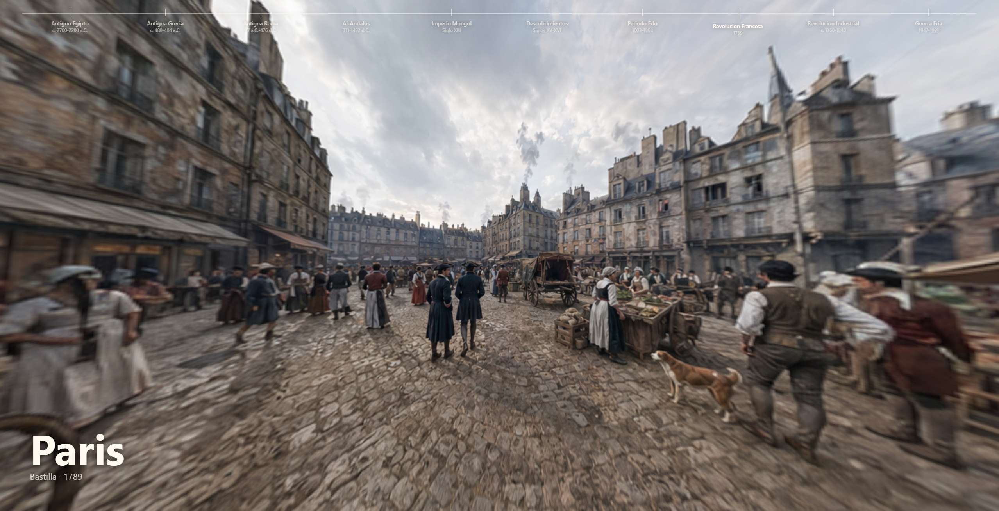

# Timeline 360 de Epocas Historicas

Aplicacion web interactiva construida con Angular para explorar distintas epocas historicas mediante escenarios panoramicos 360. La experiencia esta pensada para ser directa: entrar, elegir una epoca en el timeline superior y moverse por la escena arrastrando con el raton o con el dedo.
VISITA EL SITIO WEB AQUI: https://timeline-psi-rouge.vercel.app/

## Vista previa





## Caracteristicas

- Timeline superior minimalista con las epocas principales.
- Escenas 360 renderizadas con WebGL y Three.js.
- Interaccion mediante arrastre horizontal y vertical.
- Interfaz limpia, sin registro, login ni gestion de usuarios.
- Imagen a pantalla completa para maximizar la inmersion.
- Datos de epocas centralizados en el componente principal para poder ampliar o modificar contenido rapidamente.
- Assets panoramicos en formato 2:1 preparados para proyeccion equirectangular.

## Epocas Incluidas

- Antiguo Egipto, c. 2700-2200 a.C.
- Antigua Grecia, c. 480-404 a.C.
- Antigua Roma, 27 a.C.-476 d.C.
- Al-Andalus, 711-1492 d.C.
- Imperio Mongol, Siglo XIII.
- Descubrimientos, Siglos XV-XVI.
- Periodo Edo, 1603-1868.
- Revolucion Francesa, 1789.
- Revolucion Industrial, c. 1760-1840.
- Guerra Fria, 1947-1991.

## Tecnologias

- Angular
- TypeScript
- Three.js
- WebGL
- CSS moderno

## Requisitos

- Node.js 22 o superior recomendado.
- npm 10 o superior.

Puedes comprobar tus versiones con:

```bash
node --version
npm --version
```

## Instalacion

Clona el repositorio e instala las dependencias:

```bash
git clone <url-del-repositorio>
cd appEpocas
npm install
```

## Ejecutar en desarrollo

```bash
npm start
```

La app estara disponible en:

```text
http://127.0.0.1:4200
```

## Compilar para produccion

```bash
npm run build
```

El resultado se genera en:

```text
dist/app-epocas
```

## Estructura Principal

```text
appEpocas/
├── src/
│   ├── app/
│   │   ├── app.component.ts
│   │   ├── app.component.html
│   │   └── app.component.css
│   ├── assets/
│   │   ├── egipto.png
│   │   ├── grecia.png
│   │   ├── roma.png
│   │   ├── alandalus.png
│   │   ├── mongolia.png
│   │   ├── descubrimientos.png
│   │   ├── edo.png
│   │   ├── francia.png
│   │   ├── inglaterra.png
│   │   └── guerrafria.png
│   ├── index.html
│   ├── main.ts
│   └── styles.css
├── angular.json
├── package.json
└── README.md
```

## Como Funciona el Visor 360

Cada imagen panoramica se carga como textura en una esfera de Three.js. La camara se situa dentro de esa esfera y rota segun el arrastre del usuario. Esto crea una experiencia 360 real, no un simple desplazamiento de imagen plana.

Para que el resultado se vea correctamente, las imagenes deben ser panoramas equirectangulares con proporcion 2:1.

Formato recomendado:

```text
Resolucion minima: 4096x2048
Resolucion ideal: 8192x4096
Formato: PNG, JPG o WEBP
Proporcion: 2:1
```

Las imagenes actuales usan:

```text
1774x887
Proporcion 2:1
Formato PNG
```

## Modificar o Anadir Epocas

Las epocas estan definidas en `src/app/app.component.ts`, dentro del array `epochs`.

Ejemplo:

```ts
{
  id: 'egipto',
  title: 'Antiguo Egipto',
  years: 'c. 2700-2200 a.C.',
  city: 'Menfis',
  site: 'Meseta de Guiza',
  image: 'assets/egipto.png',
  accent: '#d6a84f'
}
```

Para anadir una nueva epoca:

1. Copia la imagen panoramica a `src/assets`.
2. Anade un nuevo objeto al array `epochs`.
3. Usa la ruta relativa `assets/nombre-imagen.png`.
4. Ejecuta `npm run build` para comprobar que todo compila.

## Personalizacion Visual

La interfaz se controla principalmente desde:

```text
src/app/app.component.css
```

Elementos principales:

- `.timeline`: slider superior.
- `.timeline__item`: cada epoca del timeline.
- `.panorama`: contenedor principal del visor 360.
- `.epoch`: texto inferior con ciudad, sitio y fecha.

## Notas de Diseno

El objetivo visual de la app es mantener una interfaz limpia y silenciosa:

- El contenido principal es la imagen 360.
- El timeline no usa tarjetas ni fondos pesados.
- El texto se reduce a la informacion esencial.
- No hay modales, menus complejos ni pantallas intermedias.

## Scripts Disponibles

```bash
npm start
```

Arranca el servidor de desarrollo.

```bash
npm run build
```

Compila la aplicacion para produccion.

```bash
npm test
```

Ejecuta los tests configurados en Angular.

## Estado del Proyecto

Proyecto en desarrollo. La base funcional ya incluye:

- Angular configurado.
- Visor 360 real con Three.js.
- Timeline historico completo.
- Diez escenas panoramicas enlazadas a sus respectivas epocas.

## Licencia

Define aqui la licencia del proyecto.

```text
MIT, Apache-2.0, GPL-3.0, propietaria, etc.
```
